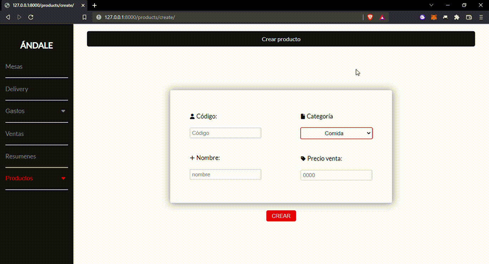

# Andale
## What does this WebApp do?
Ándale is an accounting and billing web app that I created for a local taco restaurant, it includes features
such as a bill-printing section, as well as sales and expenses registration systems.

## Sections:

* **Productos:** Allows you to create product objects, you can  also see a list of the registered products and change the products' sale price by category.
* **Gastos:** Allows you to register the shops' expenses, you can also see a list of the registered expenses.
* **Delivery:** Here you can register a delivery sale, you can add products to the sale through a form, an the print a receipt for the sale.
* **Mesas:** In this section the user can "open" restaurant tables and then register products for the table. You can then close the sale and print a receipt.
* **Sales:** Here you can see all the sales that the user registerer thrugh the Delivery and Mesas sections.
* **Resumenes:** Here you can see a daily and monthly summary for sales and expenses.

This webapp works for multiple users, so that every separate franchise of the company can use the software independently. The users log-in through a login view.

## This project Includes:

## Create views:
Create views include forms that let you create objects. In this case this user created a product named Taco de carne.

